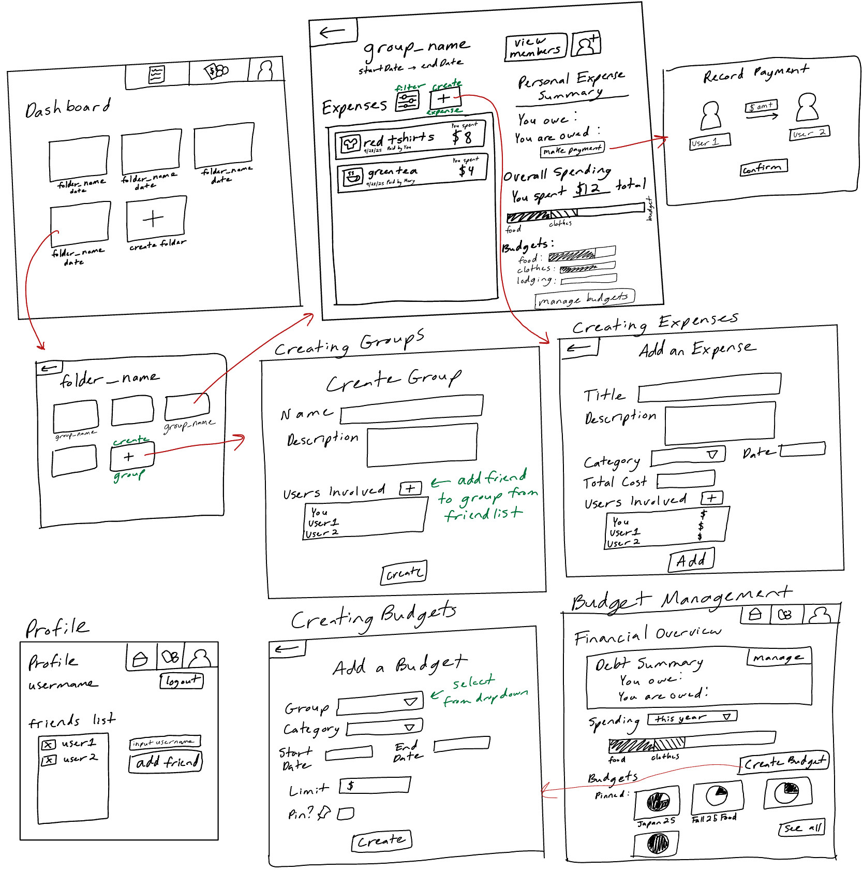
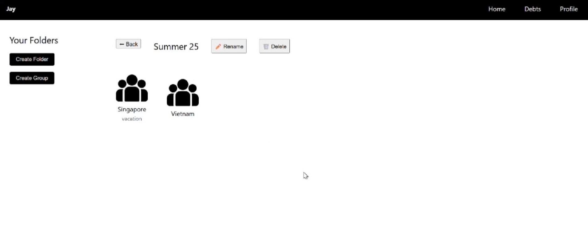
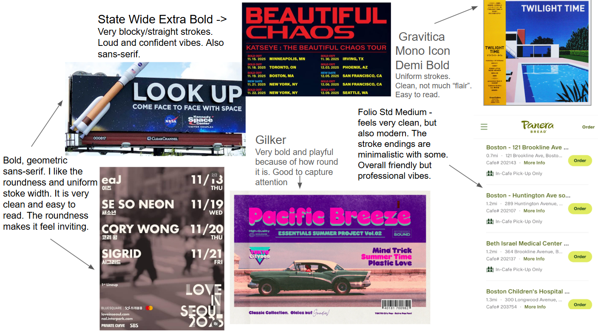
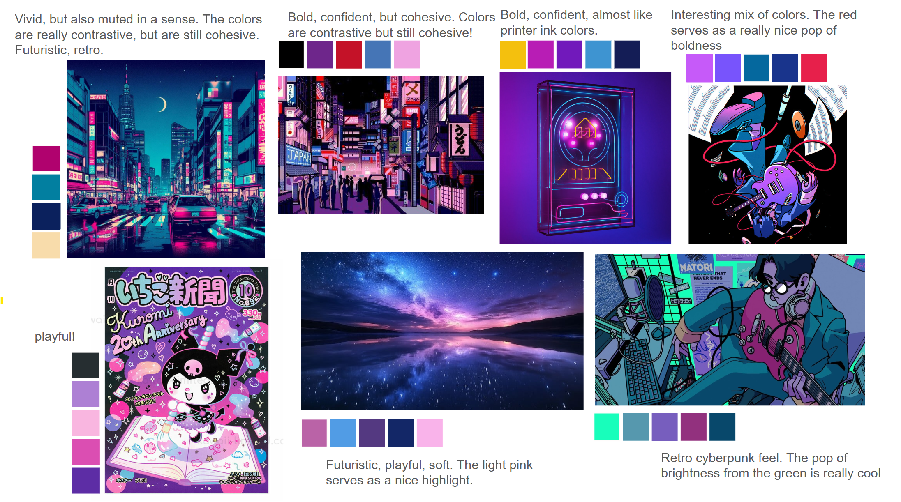
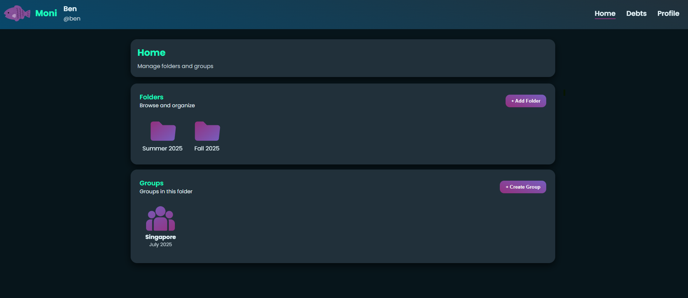

# Final Design Document

## Overview
This document summarizes how my final design evolved from my initial concept design (Assignment 2) and visual design. It includes major conceptual, visual, and implementation changes.

---

## Concept Changes from Assignment 2

### Merging and Simplifying Concepts
- **Merged PersonalExpenseTracker and GroupExpenseTracker** into a single **Expense** concept and created a new, independent **Group** concept for managing user groupings.
  - Simplified the architecture and reduced overlap between concepts.
- **Removed the Friendship concept** to narrow scope and focus on essential functionality.
- **Remove Budget concept** to narrow scope and focus on tracking debts.

### Expense and Debt Redesign
- Early versions split cost-handling between **Expense** and **Debt**, but this created complexity.
- Final version places **cost splitting and validation logic** within the **Expense** concept:
  - Uses `UserSplit` sets instead of maps for cleaner type safety.
  - Added validation ensuring all user splits match the total expense cost.
- **Debt** now only tracks direct balances between two users using positive/negative amounts.

### Authentication
- Expanded **Authentication** concept to include:
  - Session tokens for user validation and authorization.
  - Integration with the User concept for display names and edits.

### Group and Folder Refinements
- **Group**: Removed “creator-only” restrictions on user removal and added a `deleteGroup` action (only when no members remain).
- **Folder**: Added a `moveFolder` action to change a folder’s parent, inspired by LLM-generated suggestions.

---

Please view indivudal concept's design log for more details and snapshots of these changes:

- [Expense Design Log](concepts/Expense/designLog.md)

- [Debt Design Log](concepts/Debt/designLog.md)

- [Group Design Log](concepts/Group/designLog.md)

- [Folder Design Log](concepts/Folder/designLog.md)

- [Authentication Design Log](concepts/Authentication/designLog.md)

## Visual Design/User Experience Changes
### Original UI Sketch from Assignment 2:

- Here I had separate pages to go to forms to ceate a group/expense. In my final design, I decided to do a pop-up (modal) instead that goes over a main page to make the app feel more cohesive.

### Assignment 4b Check in (Initial Visual Design)
- Basic, minimalistic black-and-white styling.
- Limited visual appeal.
- Some things uncentered
- I had a side navigation bar on home page containing buttons to create a folder/group which wasn't very intuitive

**Original Visual Design at Check In**:

### Final Design
- Chose to implementma retro/cyberpunk theme** with a geometric sans-serif font for a clean but bold look.
- Created separate sections for Folders and Groups in the same folder.
- Removed the side bar and instead placed buttons next to relevant sections.
- Added animations for user interactions to make the app feel more responsive and modern.
- Introduced a mascot/logo (purple fish!) to give the app a unique identity and playful tone.
- More rounded corners, shadows, and gradients to make the app feel more modern and less flat.

**Visual Design Study**

**Final Design Screenshot**:

